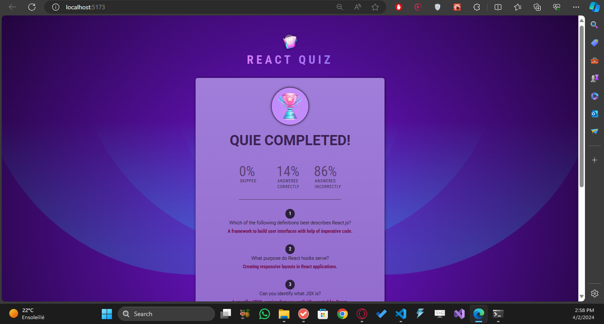

# React Quiz Application

This is a React-based quiz application that allows users to take quizzes, view their scores, and has a timer for each question.

## Features

- Interactive quiz experience built with React.
- Users can see their scores at the end of the quiz.
- Timer functionality ensures time-bound answering for each question.
- Optimized for performance.

## Technologies Used

- React
- JavaScript
- HTML
- CSS

## About the Developer

**Name:** Ben Hammouda Mohamed Ali  
**Role:** Full Stack Developer (React/.NET)

### Dashboard:

### Wrong Answer !:

### Correct Answer:

### Result:

